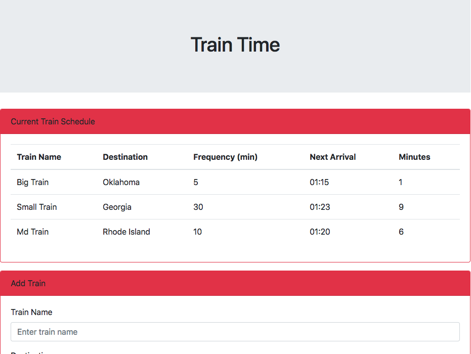

# Train Moment

### Overview

This is a train schedule.

This application displays the frequency of trains, the amount of time before the next train, and the time it is designated to arrive

Enter information in the textboxes to add a new train to the schedule.

### Additional Information

Moment.js is utilized in order to calculate the time before next train. 
Values are stored and retrieved from Firebase.

**Enjoy!**

# Hakuti.github.io

